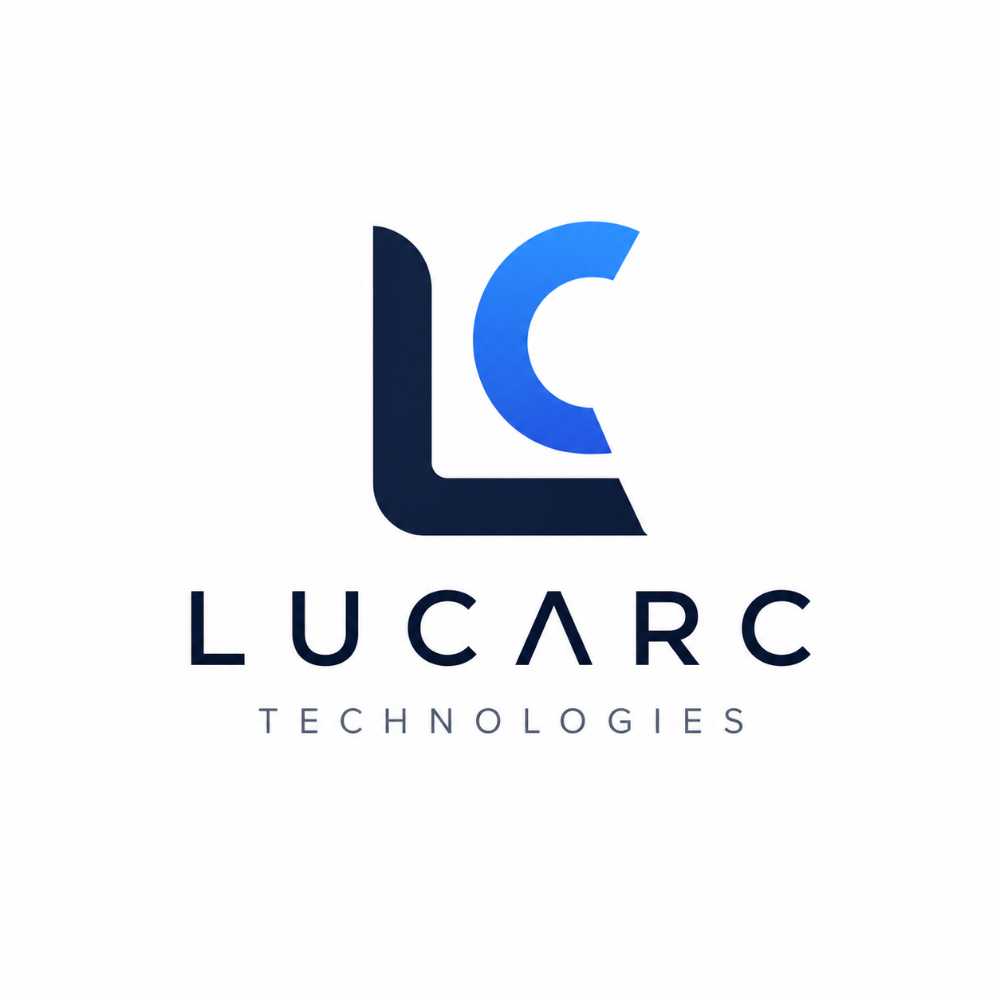

<div align="center">



# lucarc.in

### Official website of Lucarc

Building software that helps businesses work smarter and developers grow.

[GitHub Organization](https://github.com/lucarc-technologies) • [LinkedIn](https://linkedin.com/company/lucarc)

</div>

---

# Overview

This repository contains the source code for the official **Lucarc** website.

The website serves as the central hub for the Lucarc ecosystem, showcasing our company, products, engineering philosophy, and future vision.

Unlike a traditional landing page, this website is designed to evolve alongside the company and provide a single destination for our products, documentation, blog, careers, and engineering updates.

---

# About Lucarc

Lucarc is a software product company focused on building modern applications that empower businesses and developers.

We create scalable SaaS products, developer tools, and productivity platforms with an emphasis on simplicity, performance, and long-term maintainability.

---

# Products

## 🌿 ClearDays

A modern multi-tenant HRMS platform built for startups, SMEs, and enterprises.

Features include:

- Employee Management
- Attendance
- Leave Management
- Payroll
- Analytics
- RBAC
- Multi-Tenant Architecture

---

## 🚀 PrepForge

A developer-first interview preparation platform.

Features include:

- DSA Roadmaps
- System Design
- Behavioral Preparation
- STAR Story Builder
- Interview Checklists
- Progress Tracking

---

# Features

- Modern responsive UI
- Dark & Light mode
- SEO optimized
- Dynamic sitemap
- Robots configuration
- Structured metadata
- Scalable architecture
- Product showcase pages
- Company information pages
- Shared design system
- Reusable UI components

---

# Architecture

```
src/

├── app/                # Next.js App Router
├── company/            # Company modules
├── products/           # Product modules
├── components/         # Shared components
├── content/            # Static content
├── core/               # Providers, SEO, Analytics
├── assets/             # Images & logos
├── hooks/              # Custom hooks
├── lib/                # Utilities
├── services/           # API integrations
├── styles/             # Global design tokens
└── types/              # Shared types
```

---

# Design Principles

This project follows several architectural principles.

## Domain Driven Organization

Features are grouped by business domain rather than file type.

## Component Reusability

Reusable UI components are isolated from business-specific components.

## Separation of Concerns

Routing, presentation, business logic, content, and shared utilities remain independent.

## Scalability

The architecture is designed to support multiple Lucarc products without requiring major restructuring.

---

# Tech Stack

- Next.js
- React
- TypeScript
- Tailwind CSS
- App Router
- ESLint

---

# Getting Started

Clone the repository

```bash
git clone https://github.com/lucarc-technologies/lucarc.in.git
```

Install dependencies

```bash
npm install
```

Run locally

```bash
npm run dev
```

Open

```
http://localhost:3000
```

---

# Project Structure

```
public/
    Logo assets

src/

    app/
        Routing

    company/
        Company pages

    products/
        Product pages

    components/
        Shared UI

    content/
        Static data

    core/
        Providers
        SEO
        Analytics

    styles/
        Design Tokens

    lib/
        Utilities

    hooks/
        Shared Hooks

    services/
        External Services

    types/
        Shared Types
```

---

# Roadmap

- [x] Landing Page
- [x] Company Pages
- [x] Product Pages
- [ ] Engineering Blog
- [ ] Careers Portal
- [ ] Documentation
- [ ] Press Kit
- [ ] Product Changelog
- [ ] Contact Portal

---

# Governance & Community

We are committed to building an open, transparent, and collaborative engineering culture at Lucarc.

| Document | Purpose |
|---|---|
| [**CONTRIBUTING.md**](./CONTRIBUTING.md) | Project setup, folder structure, coding/naming conventions, and PR workflows |
| [**CODE_OF_CONDUCT.md**](./CODE_OF_CONDUCT.md) | Our Contributor Covenant 2.1 standards of acceptable community behavior |
| [**SECURITY.md**](./SECURITY.md) | Private vulnerability disclosure policy and SLA (`security@lucarc.in`) |
| [**SUPPORT.md**](./SUPPORT.md) | Community support channels, Discussions, and commercial help (`support@lucarc.in`) |

---

# Community & Workflow

## 💬 GitHub Discussions

We use **[GitHub Discussions](https://github.com/lucarc-technologies/lucarc.in/discussions)** as our community forum:
- **General**: Open conversations about software engineering and SaaS product design.
- **Ideas**: Share feature proposals or product suggestions.
- **Q&A**: Technical questions about setup, architecture, or configuration.
- **Announcements**: Follow Lucarc releases, roadmap milestones, and updates.
- **Show and Tell**: Showcase projects or tools built using Lucarc platforms.

## 🏷️ Standardized Labels

We use standardized repository labels to classify issues and pull requests:

- `bug`: Confirmed errors or broken functionality
- `feature`: New features or product capabilities
- `good first issue`: Accessible issues for new contributors
- `help wanted`: Extra attention or community contributions requested
- `documentation`: Improvements to markdown guides or docs
- `enhancement`: Improvements to existing features
- `performance`: Speed, bundle size, or rendering optimizations
- `security`: Security-related updates or hardening
- `breaking change`: Changes that require migration or alter APIs

## 📋 GitHub Projects & Milestones

We organize sprints and roadmap tracking using **GitHub Projects** with standardized workflow columns:
1. **Backlog**
2. **Todo**
3. **In Progress**
4. **Review**
5. **Done**

### Active Milestones
- **ClearDays v1**
- **PrepForge Beta**
- **Website v2**
- **Authentication Platform**

---

# License

Copyright © 2026 Lucarc.

All rights reserved.

This repository contains the source code for the official Lucarc website and ecosystem.

Unauthorized reproduction or redistribution is prohibited unless explicitly permitted.

---

<div align="center">

### Building software that helps businesses work smarter and developers grow.

Made with ❤️ by Lucarc

</div>